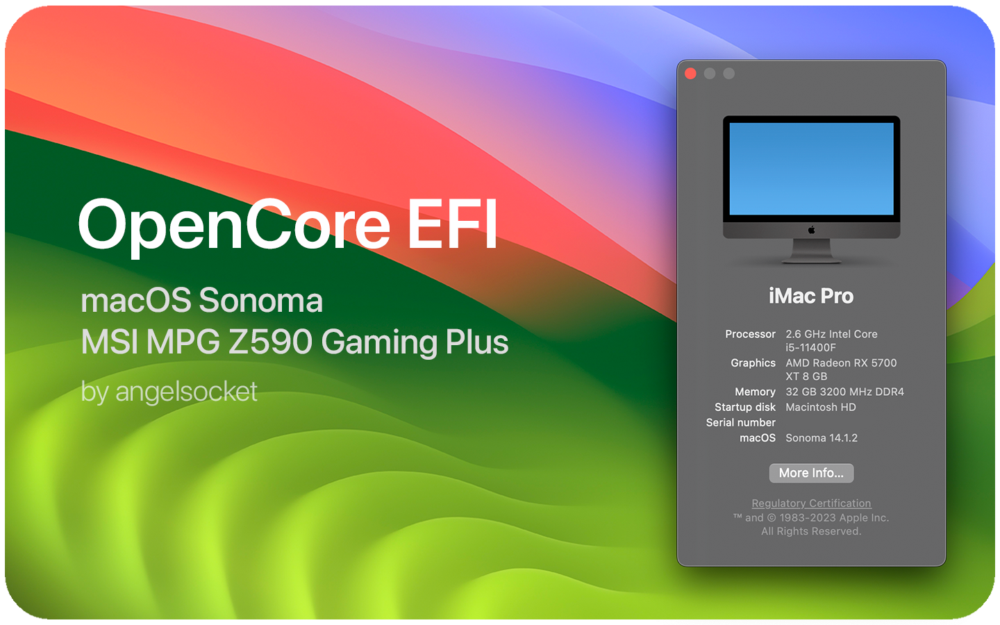

# Work in progress!

# 👋 Hello! This is Hackintosh for MSI MPG Z590 Gaming Plus

## Hardware ⚙️
- Motherboard: MSI MPG Z590 Gaming Plus
- CPU: Intel Core i5 11400F
- GPU: AMD Radeon RX5700XT 8 GB Reference
- RAM: 32GB 3200MHz DDR4 ADATA XPG Gammix D35G RGB
- NVME: 1024GB ADATA SX6000 Pro
- WiFi & BT: BCM943602CS

## Software 💾
- Bootloader: OpenCore 0.9.6
- macOS: Sonoma 14.1.1

## What works and what doesn't

<strong> Click to open! </strong>

 

- 🟢 - Fully working
- 🟠 - Partially working
- 🔴 - Not working

> ### Hardware

| Feature                              | Status | Dependency          |
| :----------------------------------- | ------ | ------------------- |
| Graphics (RX5700XT)                   | 🟢  | `WhateverGreen.kext` |
| Sound (ALC4080)                       | 🟢  | Native |
| USB Ports                            | 🟢  | `USBToolBox.kext` & `UTBMap.kext` |
| Ethernet                             | 🟢  | `AppleIntelI210Ethernet.kext` & `SSDT-I225V.aml`| 
| Sleep                                | 🔴  | Idk, Kernel Panic |

> ### macOS Continuity

| Feature                              | Status | Dependency          |
| :----------------------------------- | ------ | ------------------- |
| iCloud, iMessage, FaceTime           | 🟢   | Whitelisted Apple ID, Valid SMBIOS  |
| Time Machine                         | 🟢   | Native  |
| Continuity Camera                    | 🟢   | `FeatureUnlock.kext`  |
| AirDrop                              | 🟢  | OCLP BCM Patch  |

## Before Install
- [**Click**](/Files/BeforeInstall.md): Requirements before installing.
  
## Installation macOS
- [**Click**](https://dortania.github.io/OpenCore-Install-Guide/installer-guide/): Creating a macOS installer
- [**Click**](https://dortania.github.io/OpenCore-Install-Guide/installation/installation-process.html): Installation macOS

## Post Install
- [**Click**](/Files/PostInstall.md): Requirements after installing.

## Contact
- [**@angelsocket**](https://t.me/angelsocket): Telegram

## Credits 💖
- Apple for macOS
- Acidanthera team for OpenCore
- CorpNewt for GenSMBIOS
- Dortania for Guides
- Andrej-Antipov for MountEFI
- xzhih for one-key-hidpi
